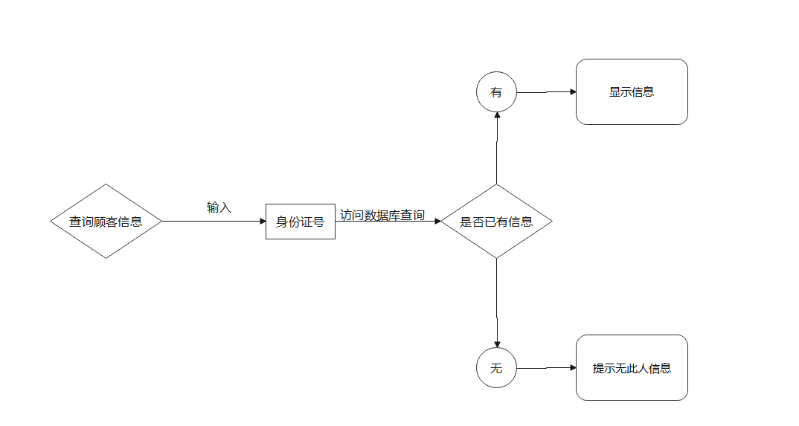
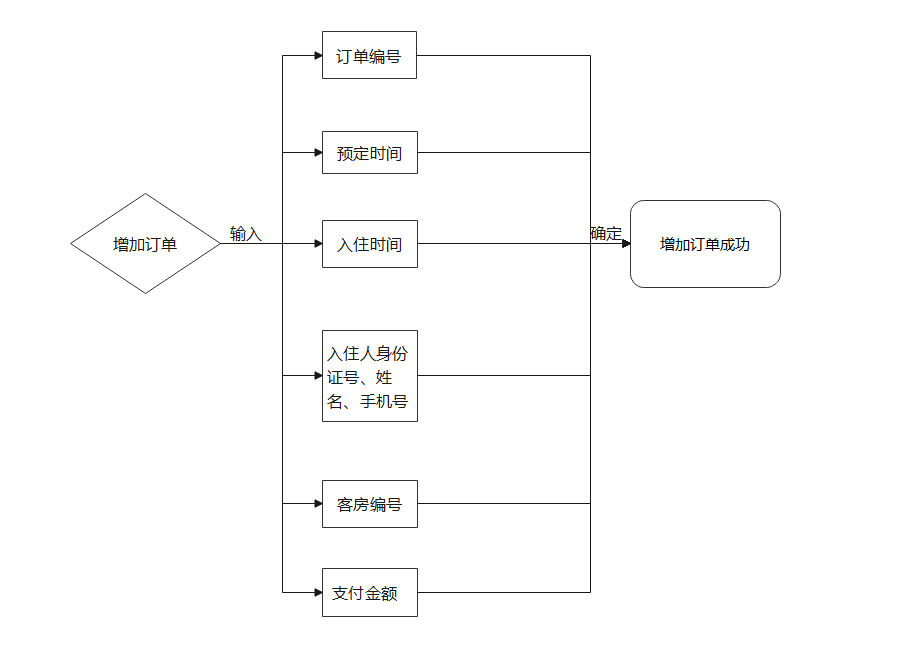
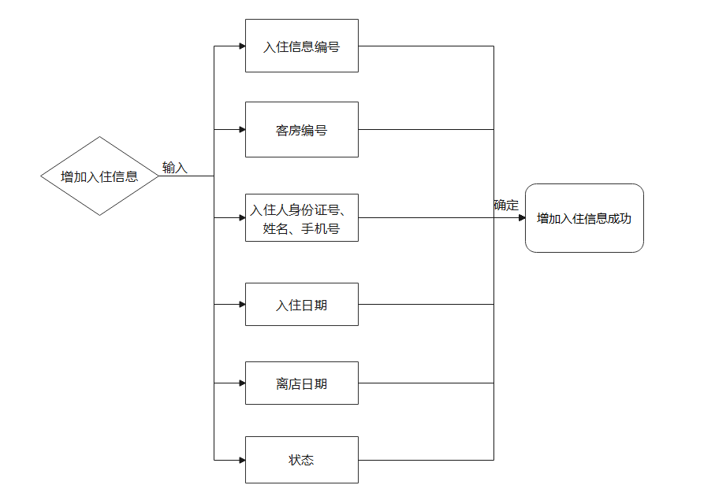

# 1 需求分析

### 1.1 角色

本酒店管理系统应用于酒店前台，角色为管理员，即前台。

### 1.2 业务流程图


### 1.3 功能流程图

##### 1.3.1 管理顾客信息

###### 1. 增加顾客信息

顾客在发出订房请求时，首先录入该顾客信息，供后续增加订单使用。


###### 2. 删除顾客信息


###### 3. 修改顾客信息


###### 4. 查询顾客信息



##### 1.3.2 管理客房信息

###### 1. 增加客房信息


###### 2. 删除客房信息


###### 3.修改客房信息


###### 4.查询客房信息


##### 1.3.3 管理订单

###### 1. 增加订单

一个订单对应一间客房。顾客支付后即增加订单。

订单编号自动生成；预定时间为支付时间；入住时间为顾客拟入住时间；入住人信息通过输入身份证号从数据库导入（可有多个入住人）；客房编号通过查询空闲的指定房型客房进行选择；支付金额为顾客支付的总金额。



###### 2. 删除订单

通过输入订单编号/客房编号，查询订单，确认并删除。

###### 3. 修改订单

通过输入订单编号/客房编号，查询订单，修改指定信息。

###### 4. 查询订单

通过输入订单编号/客房编号，查询订单。

##### 1.3.4 管理入住信息

###### 1. 增加入住信息

一个入住信息对应一间客房。生成订单后，顾客入住时，增加入住信息。

入住信息编号自动生成；客房编号、入住人信息、入住日期与订单中信息保持一致；离店日期初始为空，待客户退房时填入；状态分为入住中、续住、已退房，初始为入住中。



###### 2. 修改入住信息

通过输入入住信息编号/客房编号，查询入住信息，修改指定信息。

###### 3. 查询入住信息

通过输入入住信息编号/客房编号，查询入住信息。


# 2 数据库设计

### 2.1 表设计

##### 1. Customer

顾客信息表（身份证号、姓名、性别、手机号、打折信息）

| 属性       | 数据类型    | 非空   | 主键 | 备注    |
| ---------- | ----------- | ------ | ---- | ------- |
| customerId | VARCHAR(30) | Y      | Y    |         |
| name       | VARCHAR(30) | Y      |      |         |
| sex        | CHAR(1)     | Y      |      | F，M    |
| phoneNum   | int         | Y      |      |         |
| discount   | int         | 默认10 |      | eg：8折 |

##### 2. Room

客房信息表（客房编号、规格、状态、价格）

| 属性   | 数据类型    | 非空 | 主键 | 备注                 |
| ------ | ----------- | ---- | ---- | -------------------- |
| roomId | VARCHAR(30) | Y    | Y    |                      |
| size   | VARCHAR(30) | Y    |      | 单人间/双人间/豪华间 |
| state  | VARCHAR(30) | Y    |      | 维修/入住/空闲       |
| price  | int         | Y    |      | 原价                 |

##### 3. Order

订单信息表（订单编号、客房编号、预定时间、拟入住时间、入住人身份证号、支付金额）

| 属性        | 数据类型    | 非空 | 主键 | 备注                 |
| ----------- | ----------- | ---- | ---- | -------------------- |
| orderId     | VARCHAR(30) | Y    | Y    |                      |
| roomId      | VARCHAR(30) | Y    |      | 外键，参照Room表     |
| reserveDate | TimeStamp   | Y    |      | 生成订单的时间       |
| checkinDate | TimeStamp   | Y    |      | 拟入住时间           |
| customerId  | VARCHAR(30) | Y    |      | 外键，参照Customer表 |
| price       | Number(6,2) | Y    |      |                      |

##### 4. Checkin

入住信息表（入住信息编号、客房编号、入住人身份证号、入住日期、离店日期、状态）

| 属性        | 数据类型    | 非空     | 主键 | 备注                                           |
| ----------- | ----------- | -------- | ---- | ---------------------------------------------- |
| checkinId   | VARCHAR(30) | Y        |      | （一起开房的人此字段相同）格式：yyyy-MM-dd-num |
| roomId      | VARCHAR(30) | Y        |      | 外键，参照Room表                               |
| customerId  | VARCHAR(30) | Y        |      | 外键，参照Customer表                           |
| checkinDate | TimeStamp   | Y        |      | 真实入住时间                                   |
| leaveDate   | TimeStamp   |          |      | 真实退房时间                                   |
| state       | VARCHAR(30) | Y        |      | 入住中/续住/已退房                             |
| number      | int         | 默认1    |      | 入住人数                                       |
| UUID        | int         | auto_inc | Y    | 只是主键，没有意义                             |

##### 5. Admin

前台管理员（身份证号、姓名、性别、手机号、打折信息）

| 属性       | 数据类型    | 非空   | 主键 | 备注    |
| ---------- | ----------- | ------ | ---- | ------- |
| adminID | VARCHAR(30) | Y      | Y    |         |
| name       | VARCHAR(30) | Y      |      |         |
| password        | VARCHAR(30)     | Y      |      |     |
| rank        | VARCHAR(30)     | Y      |      |   '经理','职员'  |

### 2.2表数据

```sql
show tables ;
create table if not exists customer(
       customerId varchar(30) primary key ,
       name varchar(30),
       sex char,
       phoneNum int,
       discount int default 10
)ENGINE=InnoDB DEFAULT CHARSET=utf8;

insert into customer values('100001','李扬宁','F',17772870,8);


create table if not exists room(
    roomId varchar(30) primary key ,
    size varchar(30) default '标准间',
    state varchar(30) default '空闲' comment '维修，入住，空闲',
    price int not null comment '原价'
)ENGINE=InnoDB DEFAULT CHARSET=utf8;

insert into room values ('101','标准间','空闲',200);


create table if not exists `order`
(
       orderId varchar(30) primary key ,
       roomId varchar(30) default '标准间' references room(roomId),
       reserveDate timestamp comment '生成订单的时间',
       checkinDate timestamp comment '拟入住的时间',
       customerId varchar(30) references customer(customerId),
       price numeric(6,2)
)ENGINE=InnoDB DEFAULT CHARSET=utf8;


# datetime数据类型：
# ①插入格式中日期和时间符号-和：(要带都带，不带都不带，否则报错)，带了中间必须留有空格 如：insert into dt © values (“2019-1-12 12:18:15”);
# ②直接输入对应位数14位数如：insert into dt © values (“20191012121315”);

insert into `order` values('20220616001','101',NOW(),'20220617111111',100001,160);

# drop table checkin;
create table if not exists checkin(
      checkinId varchar(30) comment '（一起开房的人此字段相同）格式：yyyy-MM-dd-num',
      roomId varchar(30) references room(roomId),
      customerId varchar(30) references customer(customerId),
      checkInDate timestamp comment '真实入住时间',
      leaveDate timestamp comment '真实退房时间',
      state varchar(30) default '入住中',
      number int comment '入住人数',
      UUID int primary key auto_increment
)ENGINE=InnoDB DEFAULT CHARSET=utf8;

insert into checkin values ('20220616001','101','100001','20220616111111',null,'入住中',1,null);


create table if not exists admin(
    adminId varchar(30) primary key ,
    name varchar(30),
    password varchar(30),
    `rank` varchar(30) comment '经理，职员'
)ENGINE=InnoDB DEFAULT CHARSET=utf8;

insert into admin values ('1001','张天浩','123123','经理');
```

